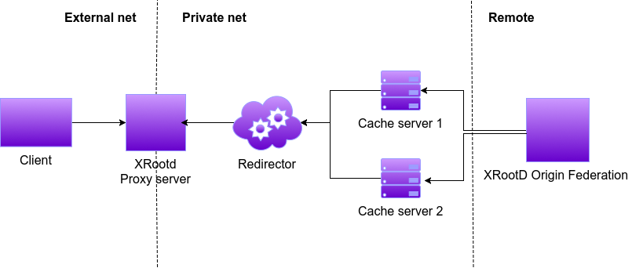
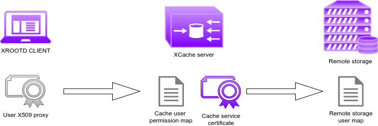

# CachingOnDemand Helm Chart

## What's XCache

XCache description is available in this article [here](https://iopscience.iop.org/article/10.1088/1742-6596/513/4/042044/pdf).

You can look at the [official XrootD documentation](http://xrootd.org/docs.html) for detailed information about the XRootD tool:

- [basic configuration](http://xrootd.org/doc/dev47/xrd_config.htm)
- [cmsd configuration](http://xrootd.org/doc/dev45/cms_config.htm)
- [proxy file cache](http://xrootd.org/doc/dev47/pss_config.htm)

## XCache components

The setup infrastructure is shown the figure below, where the clients that run the payload can be instructed to request data to a cache system deployed on the same cloud provider and thus with low latency. The cache stack consists in:

- **a proxy server** to function as bridge between the private network of the cache and the client. This server will simply tunnel the request from cache servers.
- **a cache redirector** for federating each cache server deployed. If a new server is added, it will be automatically configured to contact this redirector for registration
- **a configurable number of cache servers**, the core of the tool that are responsibles for reading-ahead from remote site while caching.



## AuthN/Z mode in XCache

### GSI



1. The client show its identity only to the cache server
2. The cache server will check in its local mapfile if the client is allowed to read the requested namespace
3. If that is the case the cache server will server the file from its disk if already cached or it will use its own certificate (robot/service/power user as needed) to authenticate with the remote storage for the reading process
4. The remote storage check its own mapfile if the robot/service/power user certificate is allowed to read from that namespace.

**N.B.** a procedure to use a user proxy forwarding approach is available but not recomended for security reasons.

### AuthN/Z mode in XCache with OIDC

Coming soon...

## Deployment on Kubernetes with Helm

### Quick Start

```bash
helm repo add dodas https://dodas-ts.github.io/helm_charts
helm repo update
helm install cod dodas/cachingondemand
```

### Values

| Value                                 | Default                                        | Description                                                             | Type    |
| ------------------------------------- | ---------------------------------------------- | ----------------------------------------------------------------------- | ------- |
| gsi.enabled                           | false                                          | Enable GSI authentication                                               | boolean |
| gsi.vo                                | null                                           | Enable GSI authentication with a VO                                     | string  |
| gsi.vomses                            | []                                             | list of files for vomses endpoints                                      | list    |
| gsi.cacheCert                         | {}                                             | cert and key for cache service certificates                             | map     |
| gsi.proxy                             | false                                          | use cache service proxy for auth with remote storage                    | boolean |
| externalIp.enabled                    | false                                          | Enable ExternalIPs for k8s services                                     | boolean |
| externalIp.ips                        | []                                             | List of ExternalIPs for k8s services                                    | list    |
| cache.image                           | cloudpg/cachingondemand                        | Cache server docker image                                               | string  |
| cache.tag                             | latest                                         | Cache server docker image tag                                           | string  |
| cache.pullPolicy                      | IfNotPresent                                   | Cache server image pull policy                                          | string  |
| cache.replicas                        | 1                                              | Number of cache pod replicas                                            | int     |
| cache.redirHost                       | xcache-redir-service.default.svc.cluster.local | Cache redirector address                                                | string  |
| cache.cachePath                       | /data/xrd                                      | Cache local path to data                                                | string  |
| cache.blockSize                       | 512k                                           | Cache file block size                                                   | string  |
| cache.memGb                           | 2                                              | Cache memory (in GB) for writing queue                                  | float   |
| cache.highWm                          | 0.95                                           | Space usage % triggering eviction untili low water mark                 | float   |
| cache.lowWm                           | 0.80                                           | Space usage % at which the eviction ended                               | float   |
| cache.nPrefetch                       | 0                                              | Number of file blocks read ahead                                        | int     |
| cache.originHost                      | xrootd-cms.infn.it                             | Remote source of data address                                           | string  |
| cache.originXrdPort                   | 1094                                           | Remote source of data port                                              | int     |
| cache.streams                         | 256                                            | Number of active xrootd streams                                         | int     |
| cache.logLevel                        | info                                           | Enable GSI authentication                                               | string  |
| cache.persistence.enabled             | true                                           | Enable data persistence                                                 | boolean |
| cache.persistence.cacheHostPath       | false                                          | Path on physical host where to save data                                | boolean |
| cache.persistence.volumeClaim.enabled | false                                          | TO BE IMPLEMENTED YET                                                   | boolean |
| cache.http.enabled                    | false                                          | TO BE IMPLEMENTED YET                                                   | boolean |
| cache.configMap.enabled               | false                                          | TO BE IMPLEMENTED YET                                                   | boolean |
| cache.nodeSelector                    | {}                                             | TO BE IMPLEMENTED YET                                                   | map     |
| cache.resources                       | {}                                             | TO BE IMPLEMENTED YET                                                   | map     |
| redirector.enabled                    | true                                           | Enable Cache server federation                                          | boolean |
| redirector.image                      | cloudpg/cachingondemand                        | Federator docker image                                                  | string  |
| redirector.image.tag                  | latest                                         | Federator docker image tag                                              | string  |
| redirector.pullPolicy                 | InNotPresent                                   | Federator image pull policy                                             | string  |
| redirector.replicas                   | 1                                              | Federator server replicas                                               | int     |
| redirector.service.type               | NodePort                                       | K8s service type for federator                                          | string  |
| redirector.service.xrootd.port        | 1294                                           | Federator container port for xroot daemon                               | int     |
| redirector.service.xrootd.targetport  | 31294                                          | Federator k8s target port for xroot daemon                              | int     |
| redirector.service.xrootd.nodePort    | 31294                                          | Federator k8s nodePort for xroot daemon (if type is NodePort)           | int     |
| redirector.service.cms.port           | 1213                                           | Federator container port for cluster manager daemon                     | int     |
| redirector.service.cms.targetport     | 31213                                          | Federator k8s target port for cluster manager daemon                    | int     |
| redirector.service.cms.nodePort       | 31213                                          | Federator k8s nodePort for cluster manager daemon (if type is NodePort) | int     |
| redirector.confiMap.enabled           | false                                          | TO BE IMPLEMENTED YET                                                   | boolean |
| redirector.nodeSelector               | {}                                             | TO BE IMPLEMENTED YET                                                   | map     |
| redirector.resources                  | {}                                             | TO BE IMPLEMENTED YET                                                   | map     |
| proxy.enabled                         | true                                           | Enable proxy service for external access                                | boolean |
| proxy.image                           | cloudpg/cachingondemand                        | Proxy service docker image                                              | string  |
| proxy.tag                             | latest                                         | Proxy service docker image tag                                          | string  |
| proxy.pullPolicy                      | IfNotPresent                                   | Proxy service image pull policy                                         | string  |
| proxy.replicas                        | 1                                              | Proxy service replicas                                                  | int     |
| proxy.service.type                    | NodePort                                       | Proxy k8s service type                                                  | map     |
| proxy.service.xrootd.port             | 1394                                           | Proxy container port for xrootd daemon                                  | int     |
| proxy.service.xrootd.targetPort       | 31394                                          | Proxy k8s target port for xrootd daemon                                 | int     |
| proxy.service.xrootd.nodePort         | 31394                                          | Proxy k8s node port for xrootd daemon (if type is NodePort)             | int     |
| proxy.configMap.enabled               | false                                          | TO BE IMPLEMENTED YET                                                   | boolean |
| proxy.nodeSelector                    | {}                                             | TO BE IMPLEMENTED YET                                                   | map     |
| proxy.resources                       | {}                                             | TO BE IMPLEMENTED YET                                                   | map     |
| fakeOrigin.enabled                    | false                                          | Deploy a fake remote storage for demo purpose only                      | boolean |
| fakeOrigin.image                      | cloudpg/cachingondemand                        | Fake origin docker image                                                | string  |
| fakeOrigin.tag                        | latest                                         | Fake origin docker image tag                                            | string  |
| fakeOrigin.pullPolicy                 | IfNotPresent                                   | Fake origin image pull policy                                           | string  |
| fakeOrigin.replicas                   | 1                                              | Fake origin pod replicas                                                | int     |
| fakeOrigin.service.type               | NodePort                                       | Fake origin k8s service type                                            | string  |
| fakeOrigin.service.xrootd.port        | 1094                                           | Fake origin container target port for xroot daemon                      | int     |
| fakeOrigin.service.xrootd.targetPort  | 1094                                           | Fake origin k8s target port for xroot daemon                            | int     |
| fakeOrigin.service.xrootd.nodePort    | 31194                                          | Fake origin k8s node port for xroot daemon (if type is NodePort)        | int     |
