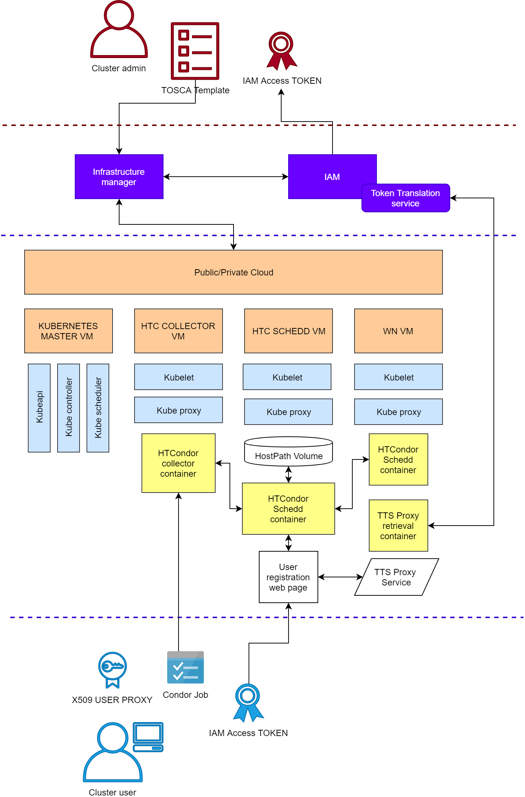
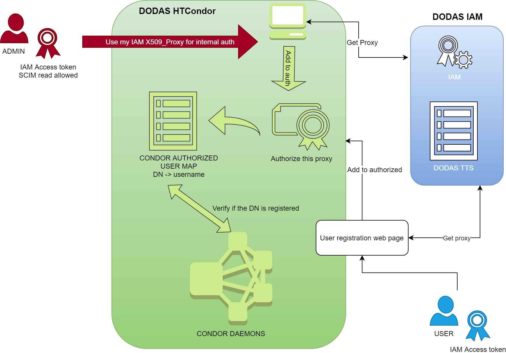

# HTCondor cluster Helm Chart

## Deployment schema



### AuthN/Z schema



## Deployment on Kubernetes with Helm

### Quick Start

```bash
helm repo add dodas https://dodas-ts.github.io/helm_charts
helm repo update
helm install htcondor dodas/htcondor
```

> **Tip**: You can use the default [values.yaml](values.yaml)

### Values

| Value                              | Default                                                      | Description                                                                                        | Type    |
| ---------------------------------- | ------------------------------------------------------------ | -------------------------------------------------------------------------------------------------- | ------- |
| condorHost                         | null                                                         | Private or public address of the HTCondor master                                                   | string  |
| ccbHost                            | null                                                         | Public address of the HTCondor master                                                              | string  |
| proxyCacheHost                     | null                                                         | Address for Token2proxy translation service Usually put this as the address of the k8s master node | string  |
| proxyCachePort                     | 30080                                                        | Exposed port for Token2proxy translation service                                                   |
| htcMaster.enabled                  | true                                                         | Enable HTCondor master deployment                                                                  | boolean |
| htcMaster.image                    | dodasts/htcondor                                             | HTCondor master docker image                                                                       | string  |
| htcMaster.tag                      | fermi                                                        | HTCondor master docker image tag                                                                   | string  |
| htcMaster.pullPolicy               | IfNotPresent                                                 | HTCondor master image pull policy                                                                  | string  |
| htcMaster.replicas                 | 1                                                            | HTCondor master replicas                                                                           | int     |
| networkInterface                   | ""                                                           | HTCondor master network interface (address) to be used                                             | string  |
| nodeSelector                       | see [values.yaml](values.yaml)                               | HTCondor master node affinity                                                                      | string  |
| htcSchedd.enabled                  | true                                                         | Enable HTCondor Sched deployment                                                                   | boolean |
| htcSchedd.image                    | dodasts/htcondor                                             | HTCondor Sched docker image                                                                        | string  |
| htcSchedd.tag                      | fermi                                                        | HTCondor Sched docker image tag                                                                    | string  |
| htcSchedd.pullPolicy               | IfNotPresent                                                 | HTCondor Sched image pull policy                                                                   | int     |
| htcSchedd.replicas                 | 1                                                            | HTCondor Sched replicas                                                                            | int     |
| htcSchedd.networkInterface         | ""                                                           | HTCondor Sched network interface (address) to be used                                              | string  |
| htcSchedd.lowPort                  | 31024                                                        | HTCondor Sched lower port limit                                                                    | int     |
| htcSchedd.highPort                 | 32048                                                        | HTCondor Sched higher port limit                                                                   | int     |
| htcSchedd.nodeSelector             | see [values.yaml](values.yaml)                               | HTCondor Sched node affinity                                                                       | string  |
| htcSchedd.persistence.enabled      | true                                                         | Enable HTCondor Sched persistence of the spool directory                                           | boolean |
| htcSchedd.persistence.size         | 5Gi                                                          | Spool directory volume size                                                                        | string  |
| htcSchedd.persistence.claimSize    | 4Gi                                                          | Spool directory volumeClaim size                                                                   | string  |
| htcSchedd.persistence.storageClass | local-storage                                                | Spool directory storage class                                                                      | string  |
| htcSchedd.persistence.mountPath    | /var/lib/condor/spool/                                       | Spool directory docker mount point                                                                 | string  |
| htcSchedd.persistence.options      | see [values.yaml](values.yaml)                               | Spool directory additional volume options                                                          | strings |
| htcWn.image                        | dodasts/htcondor                                             | HTCondor WorkerNode docker image                                                                   | string  |
| htcWn.tag                          | fermi                                                        | HTCondor WorkerNode docker image tag                                                               | string  |
| htcWn.pullPolicy                   | IfNotPresent                                                 | HTCondor WorkerNode image pullPolicy                                                               | string  |
| htcWn.replicas                     | 1                                                            | HTCondor WorkerNode replicas                                                                       | float   |
| htcWn.cpu.request                  | 1                                                            | HTCondor WorkerNode k8s cpu requested                                                              | float   |
| htcWn.cpu.limit                    | 1.5                                                          | HTCondor WorkerNode k8s cpu limit                                                                  | float   |
| htcWn.ram.request                  | 2048Mi                                                       | HTCondor WorkerNode k8s memory requested                                                           | string  |
| htcWn.ram.limit                    | 2500Mi                                                       | HTCondor WorkerNode k8s memory limit                                                               | string  |
| htcWn.slotType                     | cpus=1, mem=2000                                             | HTCondor WorkerNode condor slot type                                                               | string  |
| htcWn.nodeSelector                 | see [values.yaml](values.yaml)                               | HTCondor WorkerNode node affinity                                                                  | strings |
| htcWn.siteConfCMS.enabled          | false                                                        | enable HTCondor WorkerNode configuration for CMS experiment                                        | boolean |
| htcWn.siteConfCMS.files            | see [values.yaml](values.yaml)                               | HTCondor WorkerNode configuration files for CMS experiment                                         | list    |
| ttsCache.enabled                   | true                                                         | Enable TTS cache deployment                                                                        | boolean |
| ttsCache.image                     | dodasts/ttscache                                             | TTS cache docker image                                                                             | string  |
| ttsCache.tag                       | v1.1.0-dodas                                                 | TTS cache docker image tag                                                                         | string  |
| ttsCache.pullPolicy                | IfNotPresent                                                 | TTS cache image pull policy                                                                        | string  |
| ttsCache.replicas                  | 1                                                            | TTS cache replicas                                                                                 | int     |
| ttsCache.iamToken                  | null                                                         | IAM access token of the admin                                                                      | string  |
| ttsCache.iamClientId               | null                                                         | IAM client ID for proxy retrieval                                                                  | string  |
| ttsCache.iamClientSecret           | null                                                         | IAM client secret for proxy retrieval                                                              | string  |
| ttsCache.iamScimClientId           | null                                                         | TBD                                                                                                | string  |
| ttsCache.iamScimSecret             | null                                                         | TBD                                                                                                | string  |
| ttsCache.iamMapGroup               | ALL                                                          | TBD                                                                                                | string  |
| ttsCache.proxyAudience             | "https://dodas-tts.cloud.cnaf.infn.it"                       | TTS service audience                                                                               | string  |
| ttsCache.proxyTTS                  | "https://dodas-tts.cloud.cnaf.infn.it"                       | TTS service endpoint                                                                               | string  |
| ttsCache.proxyIAMEndpoint          | "https://dodas-iam.cloud.cnaf.infn.it/"                      | IAM service endpoint                                                                               | string  |
| ttsCache.proxyCredentialEndpoint   | "https://dodas-tts.cloud.cnaf.infn.it/api/v2/iam/credential" | IAM service endpoint for credentials                                                               | string  |
| nfs.enabled                        | false                                                        | Enable NFS volumes for WNs                                                                         | boolean |
| nfs.size                           | 1Gi                                                          | NFS volume size                                                                                    | string  |
| nfs.claimSize                      | 950Mi                                                        | NFS volumeClain size                                                                               | string  |
| nfs.server                         | DUMMY                                                        | NFS master address                                                                                 | string  |
| nfs.path                           | "/"                                                          | NFS volume path                                                                                    | string  |
| nfs.mountPath                      | "/"                                                          | NFS volume mount path                                                                              | string  |
| cvmfs.enabled                      | false                                                        | Enable CVMFS volumes for WNs                                                                       | boolean |
| cvmfs.image                        | cloudpg/cvmfs                                                | CVMFS pod image                                                                                    | string  |
| cvmfs.tag                          | k8s                                                          | CVMFS pod image tag                                                                                | string  |
| cvmfs.pullPolicy                   | IfNotPresent                                                 | CVMFS pod image pullPolicy                                                                         | string  |
| cvmfs.replicas                     | 1                                                            | CVMFS pod replicas                                                                                 | int     |
| cvmfs.repoList                     | cms.cern.ch oasis.cern.ch                                    | CVMFS repos to be mounted                                                                          | strings |
| cvmfs.privKey                      | dummy content                                                | Set the content of CVMFS cvmfs keys                                                                | string  |
| cvmfs.defaultLocalConfig           | dummy content                                                | Set the content of CVMFS config files                                                              | list    |
| squid.enabled                      | true                                                         | Enable squid deployment                                                                            | boolean |
| squid.image                        | dodasts/squid                                                | squid docker image                                                                                 | string  |
| squid.tag                          | v1.1.0-dodas                                                 | squid docker image tag                                                                             | string  |
| squid.pullPolicy                   | IfNotPresent                                                 | squid image pull policy                                                                            | string  |
| squid.replicas                     | 1                                                            | squid replicas                                                                                     | int     |
